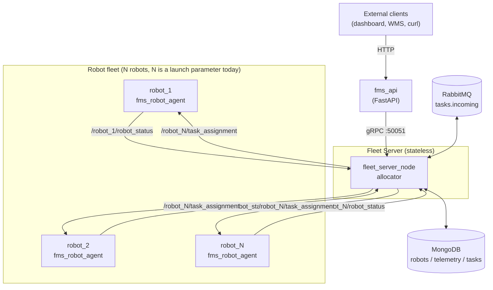
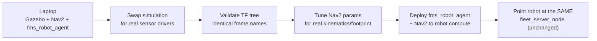
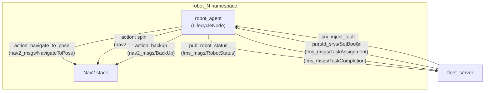
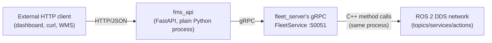
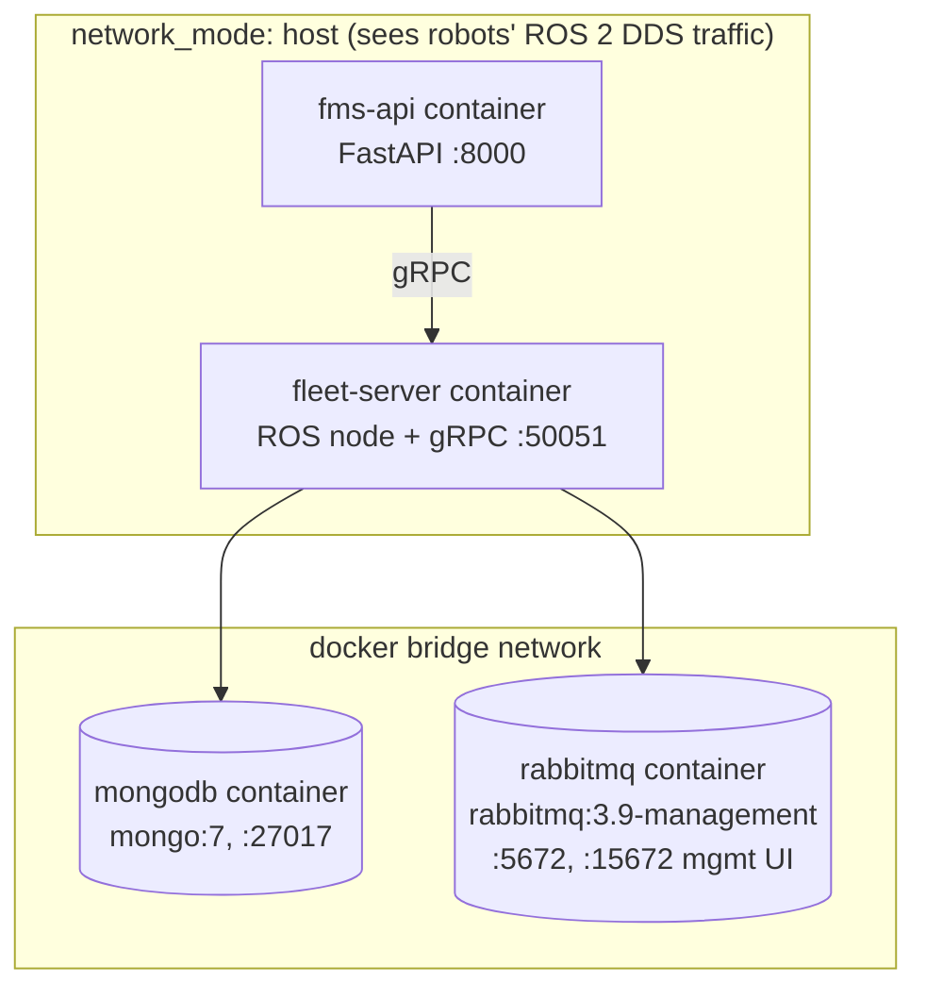
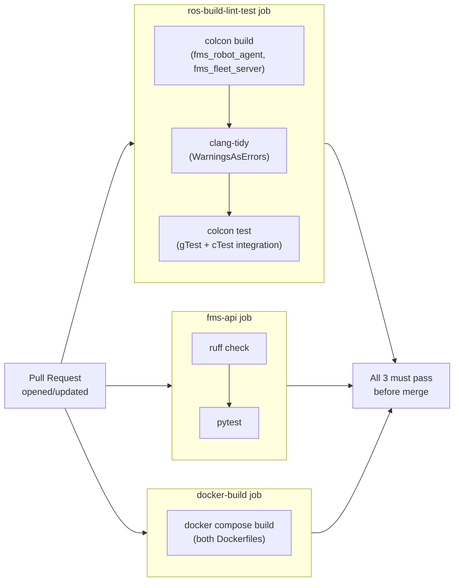

# FMS System Architecture & Mental Map

**Status note up front:** everything in Sections 1–4 marked "✅ As-Built" is
verified against this repository's actual code (file paths cited). Sections
on physical hardware, edge compute, and sim-to-real deployment are marked
**"📋 Recommended"** — this project has been built and tested entirely in
**Gazebo Harmonic simulation** (no physical robot exists yet), so those
parts are an architect's blueprint for the next phase, not a description of
something already running. Don't read a 📋 section as "this is what we
have" — read it as "this is what the as-built software is designed to
plug into."

---

## 1. Problem Statement & Scalability

### 1.1 What problem does this solve?

A warehouse (or any facility) with multiple autonomous mobile robots (AMRs)
needs a layer above individual robot autonomy that answers three questions
continuously:

1. **Which robot does this task?** (task allocation)
2. **Where is every robot right now, and is it healthy?** (fleet
   visibility — battery, state, position)
3. **What happened to a task I submitted an hour ago?** (durable task
   lifecycle tracking, survives a robot or server restart)

Without this layer, you have N independent robots that can each navigate
and execute a task, but nothing coordinates *which* robot gets *which*
task, nothing remembers a task if the process handling it crashes, and
nothing external (a warehouse management system, a human operator's
dashboard) has a single place to ask "what's my fleet doing?"

This system (`fms_fleet_server` + `fms_api`) is exactly that
coordination layer, sitting **above** standard ROS 2 Nav2-based robot
autonomy (which each robot already has independently via
`fms_robot_agent`).

### 1.2 Scalability design

- **Adding more robots is a parameter, not a code change.** `num_robots`
  is a ROS parameter on `fleet_server_node`
  (`src/fms_fleet_server/src/fleet_server_node.cpp`) — the constructor
  loops `for (int i = 1; i <= num_robots_; ++i)` creating a subscription,
  publisher, and fault-injection client per robot
  (`/robot_N/robot_status`, `/robot_N/task_assignment`,
  `/robot_N/inject_fault`). No per-robot code path is hand-written.
- **The fleet server is stateless by design.** All real state lives in
  MongoDB (`robots`, `telemetry`, `tasks` collections) and RabbitMQ (the
  `tasks.incoming` queue + `tasks.dlx` dead-letter exchange). This is a
  documented design decision (`docs/PLAN.md`): "Fleet server is stateless
  — state lives in MongoDB + RabbitMQ. Horizontally scalable." In
  practice today there is one `fleet_server_node` process; horizontal
  scaling (running 2+ fleet-server replicas behind a load balancer) is
  *architecturally possible* because of this decision but **not yet
  implemented or tested** — see §5's gotchas on why ROS topic-based
  fan-out specifically would need more thought before doing this (a
  second fleet-server replica subscribing to the same topics would
  receive duplicate messages, which is fine for status aggregation but
  would double-process task requests unless the allocator path is
  changed to consume from RabbitMQ exclusively, with one consumer).
- **Traffic scaling**: external load goes through `fms_api` → gRPC, not
  ROS. gRPC is a normal HTTP/2-based RPC framework — `fms_api` itself can
  be horizontally scaled (multiple `uvicorn` workers/containers) since it
  holds no state (`src/fms_api/fms_api/grpc_client.py` opens a new
  channel per process, no shared state). The bottleneck under heavy
  submission load is **not** the network layer but the allocator's
  cached-status race documented in `docs/PROJECT_STATUS.md`'s Step 3.6
  notes — `select_robot` scores against a `latest_status_` snapshot that
  lags by up to one status-publish interval, so bursts faster than that
  interval can mis-route. This is the actual scaling bottleneck to fix
  before increasing real-world task throughput, not infrastructure.

### 1.3 Repurposing for other use cases

The architecture separates three concerns that map directly onto "what
changes" for a different use case:

| Layer | What it knows about | Changes needed for delivery/inspection/etc. |
|---|---|---|
| `fms_robot_agent` (per-robot BT + FSM) | How to do *a* task: navigate → execute → report | Swap `ExecutePickDrop`'s BT action for `ExecuteDeliveryDropoff`/`ExecuteInspectionScan`. The 7-state FSM (`IDLE→ASSIGNED→NAVIGATING→EXECUTING→REPORTING/RECOVERING/CHARGING`) is generic enough to not need changes for most "go somewhere, do a thing, come back" tasks. |
| `fms_msgs/TaskAssignment` | Pick/drop pose, `task_type` enum (`TASK_PICK/TASK_DROP/TASK_CHARGE`) | Add new `task_type` values; the message already carries `payload_id`, `priority`, `deadline_secs` generically. |
| `fms_fleet_server`'s allocator (`task_allocator.cpp`) | Distance + battery SOC scoring | This is the part most specific to "warehouse with charging docks." Inspection (no payload, maybe time-windowed) or delivery (outdoor, GPS-based distance) would need a different scoring function — but it's already isolated as a single pure function (`select_best_robot`), specifically refactored in Phase 4.4 to be swappable/testable independent of ROS/Mongo/RabbitMQ. |

The REST API (`fms_api`) and Docker/CI layers are entirely domain-agnostic
— they don't know or care what a "task" represents.

---

## 2. Hardware Architecture & Sim-to-Real Deployment

### 2.1 Robot specifications — ✅ As-Built (simulated) / 📋 Recommended (real)

**✅ As simulated today** (`src/fms_gazebo/.../fms_robot.urdf.xacro`):

| Property | Value |
|---|---|
| Chassis (base_link) | 0.6 m (L) × 0.4 m (W) × 0.2 m (H) |
| Drive | Differential drive, 2 driven wheels + 1 caster |
| Wheel radius | 0.1 m |
| Wheel separation | 0.45 m |
| Max linear velocity (sim) | ±1.0 m/s |
| Max acceleration (sim) | ±3.0 m/s² |
| Footprint used by Nav2 costmaps | `robot_radius: 0.25` m (circular approximation) |

**📋 Recommended for a real AMR** of similar class (small-to-medium
warehouse tote-carrier, this is general industry guidance, not something
in this repo):
- Keep the differential-drive kinematic model if physically replicating
  this design — Nav2's `RegulatedPurePursuitController` (already
  configured) assumes the simulated kinematics; switching to mecanum/
  omnidirectional drive in hardware requires reconfiguring the controller
  plugin and republishing a different odometry model, not just a
  hardware swap.
- Define a **real footprint polygon** (not just a circular radius) in
  `nav2_params.yaml`'s costmap config once the physical chassis shape is
  known — circular approximation is fine in sim, risky for a rectangular
  chassis near shelving in reality.
- E-stop: physical hardware needs a hardware-level emergency stop circuit
  that cuts motor power independent of software. **This has no software
  equivalent in the current simulation** and must be designed before any
  real deployment — see §5 safety gotchas.

### 2.2 Sensor suite

**✅ As simulated today** (`fms_robot.urdf.xacro` — verified plugin config):

| Sensor | Plugin | Topic | Specs | Purpose |
|---|---|---|---|---|
| 2D LiDAR | `gz-sim` `gpu_lidar` | `/robot_N/scan` | 360° FOV, 360 samples (1° res), range 0.12–12.0 m, 10 Hz, Gaussian noise σ=0.01 | Nav2 obstacle avoidance (costmap `obstacle_layer`), AMCL localization, SLAM Toolbox mapping |
| IMU | `gz-sim` `imu` | `/robot_N/imu` | 100 Hz, angular velocity noise σ=0.002, linear accel noise σ=0.017 | Odometry fusion (not currently fused — see gotcha below), orientation sanity-check |
| Wheel encoders (implicit) | `gz-sim-diff-drive-system` | `/robot_N/odom` | 20 Hz odom publish rate | Primary odometry source for `odom→base_footprint` TF |

**📋 Recommended additions for real-world deployment** (not in this repo,
standard for this robot class):
- **Depth camera** (e.g. Intel RealSense D435/D456) — the simulated robot
  has no camera at all. A 2D lidar alone is blind to low/overhanging
  obstacles (e.g. a pallet's overhang, a person's legs vs. a chair). For
  pick-and-drop near shelving specifically, a depth camera mounted to see
  the pick/drop zone is close to mandatory in practice, not optional.
- **Wheel encoders are real, separate hardware** in reality — the sim's
  `odom` topic is a physics-engine ground-truth approximation. Real
  encoder odometry drifts significantly more and should be fused with
  IMU via `robot_localization`'s EKF node — **this fusion does not exist
  in the current stack** (IMU is published but nothing subscribes to
  it for fusion; verified — no `ekf_node`/`robot_localization` config
  found in `fms_navigation`).
- **Bumper/contact or ToF sensors** for last-centimeter collision safety
  closer than the lidar's 0.12 m minimum range.
- **3D lidar or stereo**, only if operating in highly dynamic/cluttered
  environments beyond what a 2D scan handles — usually overkill for a
  structured warehouse aisle.

### 2.3 Compute — 📋 Recommended

No edge compute target is specified or tested in this repo (Gazebo runs
on a laptop). For real deployment, the workload to budget for per robot
is: Nav2 (planner + controller + costmaps + AMCL), the BT+FSM agent
(`fms_robot_agent`, lightweight), sensor drivers, and DDS networking.

- **Minimum viable**: NVIDIA Jetson Orin Nano / Orin NX, or an x86 mini-PC
  (Intel N100/i5 class) — Nav2 itself is not GPU-bound, but a depth
  camera's point-cloud-to-costmap pipeline benefits from Jetson's GPU.
- Run **ROS 2 Humble natively** on the robot's compute (matching this
  project's existing ROS distro — do not mix distros across the fleet).
- If reusing this repo's Docker images, build them `--platform
  linux/arm64` as well if targeting Jetson (the current
  `docker/fleet-server.Dockerfile`/`fms-api.Dockerfile` are
  `linux/amd64` by default on a typical CI/dev machine — multi-arch
  builds need `docker buildx`, not yet configured in
  `.github/workflows/ci.yml`).

### 2.4 Sim-to-real deployment strategy — 📋 Recommended

The key insight specific to this codebase: **`fms_fleet_server` and
`fms_api` need zero changes to work with a real robot.** They only ever
see `fms_msgs::RobotStatus`/`TaskAssignment`/`TaskCompletion` over ROS
topics and the `/robot_N/inject_fault` service — they have no Gazebo or
simulation dependency anywhere (verified: no `gz`/`gazebo` import in
`fms_fleet_server` or `fms_api`). The entire sim-to-real effort is
scoped to `fms_gazebo` (replaced entirely by real hardware drivers) and
`fms_navigation`/`fms_robot_agent` (same code, retuned parameters).

Concrete steps:
1. **Bring up real sensor drivers** publishing to the *exact* topic names
   the URDF/Gazebo plugins currently use (`/robot_N/scan`, `/robot_N/imu`,
   `/robot_N/odom`) — e.g. real lidar driver remapped to `/robot_N/scan`.
   This is the main lever: if topic names/frame names match, Nav2 and
   `fms_robot_agent` don't know or care that the data source changed.
2. **Replace `odom_to_tf.py`'s role carefully.** This script
   (`src/fms_gazebo/scripts/odom_to_tf.py`) currently republishes
   `nav_msgs/Odometry` as a TF transform because of "a QoS mismatch"
   with `ros_gz_bridge` (per its own docstring) — that's a
   simulation-bridge-specific workaround. On real hardware, your
   wheel-odometry driver or `robot_localization`'s EKF node should
   publish `odom→base_footprint` directly; don't carry this script's
   Gazebo-specific workaround into production.
3. **Re-tune `nav2_params.yaml`** (`src/fms_navigation/config/`) for the
   real robot's actual max velocity/acceleration (sim values: ±1.0 m/s,
   ±3.0 m/s² — almost certainly need lowering for a real loaded AMR) and
   replace the circular `robot_radius: 0.25` with the true footprint.
4. **Re-run AMCL/SLAM Toolbox mapping** in the real environment — the
   `maps/warehouse.yaml` is a simulated map, useless for a real building.
5. **Deploy `fms_robot_agent` + Nav2 to the robot's onboard compute**,
   `fms_fleet_server`/`fms_api`/MongoDB/RabbitMQ stay on a
   server/edge-gateway machine — exactly the architecture
   `docker-compose.yml` already encodes (`network_mode: host` for
   `fleet-server` specifically so it can see ROS 2 DDS traffic from
   robots that are no longer on the same Gazebo process — this was
   already designed with "robots on a different machine than the fleet
   server" in mind, see `docs/PHASE4_PLAN.md`'s design decisions).

---

## 3. ROS 2 Software Architecture (The Core)

### 3.1 Nodes

| Node | Type | Runs where | File |
|---|---|---|---|
| `robot_agent` (one per robot, e.g. `/robot_1/robot_agent`) | `rclcpp_lifecycle::LifecycleNode` | On each robot | `src/fms_robot_agent/src/robot_agent_node.cpp` |
| `fleet_server` | `rclcpp::Node` | Central server | `src/fms_fleet_server/src/fleet_server_node.cpp` |
| Nav2 stack (`planner_server`, `controller_server`, `bt_navigator`, `behavior_server`, `amcl`) | Standard Nav2 lifecycle nodes | On each robot, namespaced `/robot_N/...` | `src/fms_navigation` |
| `fms_api` (`uvicorn` process) | Not a ROS node — a plain Python/FastAPI process that talks to `fleet_server` over gRPC | Central server (or its own container) | `src/fms_api` |

**Why `robot_agent` is a `LifecycleNode` but `fleet_server` is a plain
`Node`:** the robot agent needs explicit `unconfigured → inactive →
active` control so it doesn't start ticking its BehaviorTree before
Nav2's action servers and TF are ready (`on_configure` creates action
clients/pub/subs, `on_activate` starts the BT/battery/status timers — see
`robot_agent_node.cpp`). The fleet server has no such startup-ordering
dependency on anything robot-side; it's fine subscribing to topics that
don't have a publisher yet (ROS topics are inherently late-joining-safe).

### 3.2 Communication: Topics, Services, Actions

| Interface | Name | Type | Direction |
|---|---|---|---|
| Topic | `/robot_N/robot_status` | `fms_msgs/RobotStatus` | robot → fleet (every 500ms, `status_timer_`) |
| Topic | `/robot_N/task_assignment` | `fms_msgs/TaskAssignment` | fleet → robot |
| Topic | `/robot_N/task_completion` | `fms_msgs/TaskCompletion` | robot → fleet |
| Topic | `/fleet/task_request` | `fms_msgs/TaskAssignment` (unassigned) | external → fleet (alternate entry point to gRPC `SubmitTask`) |
| Service | `/robot_N/inject_fault` | `std_srvs/SetBool` | fleet → robot (and manual testing) |
| Action (client in robot_agent) | `/robot_N/navigate_to_pose` | `nav2_msgs/action/NavigateToPose` | robot_agent → Nav2 |
| Action (client in robot_agent) | `/robot_N/spin` | `nav2_msgs/action/Spin` | robot_agent → Nav2 (recovery) |
| Action (client in robot_agent) | `/robot_N/backup` | `nav2_msgs/action/BackUp` | robot_agent → Nav2 (recovery) |
| gRPC RPC | `SubmitTask` / `GetFleetStatus` / `GetTaskStatus` / `SendRobotCommand` | `fleet.proto` | `fms_api`/external gRPC clients → `fleet_server` |

**`fms_msgs` field reference** (the only 3 custom message types in the
whole system):
- `RobotStatus`: `header`, `robot_id`, `state` (enum 0–6:
  IDLE/ASSIGNED/NAVIGATING/EXECUTING/REPORTING/RECOVERING/CHARGING),
  `pose`, `battery_soc`, `current_task_id`, `status_message`.
- `TaskAssignment`: `header`, `task_id`, `robot_id`, `task_type` (enum
  0–2: PICK/DROP/CHARGE), `pick_pose`, `drop_pose`, `payload_id`,
  `priority`, `deadline_secs`.
- `TaskCompletion`: `header`, `task_id`, `robot_id`, `result` (enum 0–2:
  SUCCESS/FAILED/CANCELLED), `duration_secs`, `error_message`.

### 3.3 The bridge: ROS 2 ↔ external world

There is **no direct bridge between ROS 2 topics and the outside world.**
This is a deliberate chokepoint, not a gap:

`fleet_server_node` is **simultaneously** a ROS 2 node *and* a gRPC
server (`FleetGrpcServer` runs on its own thread inside the same process
— `grpc_thread_ = std::thread(&FleetGrpcServer::run, ...)` in
`fleet_server_node.cpp`). The gRPC handlers (`fleet_grpc_server.cpp`) call
straight back into `FleetServerNode`'s public methods
(`submit_task`/`get_fleet_status`/`get_task_status`/`send_robot_command`),
which then do normal ROS topic publishes/service calls. So:

- **External (non-ROS) clients never see ROS at all** — they speak
  REST/JSON to `fms_api`, which speaks gRPC to `fleet_server`.
- **Robots never see gRPC, HTTP, MongoDB, or RabbitMQ** — documented
  design decision (`docs/PHASE3_PLAN.md`): "Robot agents communicate ONLY
  via gRPC... wait, via ROS topics to fleet server. No direct DB access
  from robots." Robots only ever speak ROS.
- This single-process dual-protocol bridge is *why* `fms_api` adds no
  new ROS dependency at all (verified: `fms_api`'s `requirements.txt` has
  zero `rclpy`/ROS packages) — it's a pure Python/gRPC client, the ROS
  bridging already happened inside `fleet_server_node`.

### 3.4 Task orchestration

Two layers, deliberately separated:

1. **Per-robot orchestration — BehaviorTree.CPP v3** (`robot_agent.xml`,
   ticked every 50ms by `bt_timer_`). The BT decides, every tick, what a
   *single* robot should be doing right now: charge if low battery
   (`ChargeWhenLow` branch), else run the `TaskExecution` branch
   (`RequestTask → NavigateToPose → ExecutePickDrop → ReportStatus`,
   with `RequestRecovery` as a fallback on navigation failure). The BT's
   decisions are backed by — and kept consistent with — the
   `RobotFSM` (`robot_fsm.cpp`)'s 7-state machine, which is the
   ground-truth "what state am I actually in" tracker, independently
   unit-tested (Phase 4.4, `test/test_robot_fsm.cpp`).
2. **Fleet-wide orchestration — the allocator** (`task_allocator.cpp`,
   a pure function, no BT). Given an incoming task and the fleet's
   current snapshot of robot statuses, it scores every `STATE_IDLE`
   robot by `distance_to_pick + (100 - battery_soc) * soc_weight` and
   picks the lowest score. This is intentionally *not* a BT — Phase 3's
   plan considered wrapping it in a BT for more complex decisions ("if no
   robot qualifies, requeue and wait") but kept it as a simple scoring
   function for v1, a decision still in effect.

RabbitMQ (`tasks.incoming` queue, `tasks.dlx` dead-letter exchange) adds
a third layer: **decoupling submission rate from allocation rate** for
the ROS-topic/AMQP task-request path specifically. (Note: the gRPC
`SubmitTask` path — what `fms_api` actually uses — calls the allocator
**directly**, bypassing RabbitMQ entirely; this was a correction made
during Phase 4.5's integration test work, documented in
`docs/PHASE4_PROGRESS.md`. RabbitMQ is exercised by the separate
`/fleet/task_request` topic and `scripts/task_request_amqp.py`.)

---

## 4. Infrastructure, Servers & CI/CD Pipeline

### 4.1 Server architecture

| Server/Container | Purpose | Why this design |
|---|---|---|
| `fleet-server` | Aggregates robot status, runs the allocator, exposes gRPC | `network_mode: host` — must see the same DDS multicast/unicast traffic as robots on the host network, which a bridge-networked container would not (Docker bridge networks isolate the container's network namespace from the host's, breaking ROS 2 discovery) |
| `fms-api` | REST↔gRPC translation, the only thing external HTTP clients ever touch | `network_mode: host` too, purely so it can reach `fleet-server`'s gRPC port at `localhost:50051` and `mongodb`/`rabbitmq` at `localhost:*` without container-to-container DNS — simpler than building a Docker network bridge across `network_mode: host` and a regular bridge network |
| `mongodb` | Persists `robots`/`telemetry`/`tasks` — survives a `fleet_server_node` restart | Standard bridge network + published port, since it doesn't need DDS visibility, only TCP from `fleet-server` |
| `rabbitmq` | Decouples task-request submission from allocation; dead-letters failed/timed-out tasks | Same — bridge network, published ports (5672 AMQP + 15672 management UI) |
| **Not containerized**: Gazebo, Nav2, robot agents | — | Explicit design decision (`docs/PHASE4_PLAN.md`) — simulation needs a GPU/display; in real deployment this becomes "runs on the robot's own onboard compute," which is also not something you'd want centrally containerized |

**There is no separate Web UI or WebSocket server in this codebase
today.** `fms_api` is REST-only (request/response, no live push channel).
A real-time fleet dashboard would need to add a WebSocket endpoint to
`fms_api` (FastAPI supports this natively) or a separate small service
subscribing to `GetFleetStatus` on a poll loop and pushing to connected
browser clients — **this is a gap to design, not something already
built**, flagging it explicitly since the question asked about it.

### 4.2 Containerization (Docker)

- **Consistency goal**: the same `fleet-server.Dockerfile`/`fms-api.Dockerfile`
  produce the same image whether built on a developer laptop or a CI
  runner — eliminates "works on my machine" specifically for the
  hardest-to-reproduce dependency in this stack: **mongocxx**, which
  isn't available via `apt` at the version this project needs and must
  be compiled from source (`mongo-c-driver` 2.3.1 + `mongo-cxx-driver`
  r4.3.1, ~10–15 minutes — see `docs/PHASE3_PREREQUISITES.md`). The
  Dockerfile's builder stage encodes that exact build once; nobody needs
  to repeat the manual prerequisite steps by hand again.
- **Multi-stage builds**: `fleet-server.Dockerfile`'s builder stage has
  the full compiler toolchain + mongocxx source build; the runtime stage
  only copies the compiled `.so`s and `install/` output — keeps the
  shipped image leaner and avoids shipping a C++ compiler to production.
- **What Docker does *not* cover yet**: multi-architecture builds
  (Jetson/ARM64 target for real robots — see §2.3), and the robot-side
  software (`fms_robot_agent`, Nav2) isn't containerized at all currently
  — only the server-side 4 services are.

### 4.3 CI/CD pipeline

(`.github/workflows/ci.yml`)

- **Build → lint → test, sequential within one job** (for the C++
  packages) because lint (`clang-tidy`) and test (`colcon test`) both
  need the build's compiled artifacts/`compile_commands.json` — no point
  re-building per stage.
- **Three jobs run in parallel** (a deliberate deviation from a strictly
  linear pipeline) because they test independent things: the ROS/C++
  side, the Python REST side, and "do the Dockerfiles still build."
  Parallel jobs mean a PR gets feedback faster; all three still gate the
  merge.
- **mongocxx is cached** (`actions/cache`, keyed on driver version)
  across CI runs — the same from-source build problem as the Dockerfile,
  solved the same way, so CI doesn't pay the 10–15 minute compile cost on
  every single run.
- **Service containers for integration testing**: the `ros-build-lint-test`
  job spins up `mongodb`/`rabbitmq` as GitHub Actions service containers
  and deliberately runs **directly on the runner, not inside a
  `ros:humble-ros-base` container** — specifically so those services are
  reachable at `localhost`, matching `fleet_server_node`'s and the
  integration test's existing hardcoded defaults with zero code changes.
  This means Phase 4.5's mock-robot integration test (gRPC →
  allocator → MongoDB, no Gazebo needed) actually *executes* in CI rather
  than hitting its designed-in SKIP path.
- **What's not yet automated**: actual deployment. This pipeline builds
  and tests; it does not push images to a registry or deploy to a fleet
  of robots. "Push to the fleet" (asked about in the prompt) does not
  exist yet in this repo — adding a `docker push` + a rollout mechanism
  (even something as simple as SSH + `docker compose pull && up -d` on a
  central server, plus an OTA mechanism for the robot-side software,
  which is a materially different and harder problem than server-side
  deployment) is future work, not present in `.github/workflows/ci.yml`
  today.

---

## 5. The Ultimate Generalization Guide

### 5.1 Core principles for building any autonomous robot (AMR or manipulator)

1. **Separate "can I physically do X" from "should I do X right now" from
   "who in the fleet should do X."** This codebase's 3-layer split
   (Nav2 = physical capability, BT+FSM = per-robot decision, allocator =
   fleet decision) generalizes directly to a manipulator: Nav2 →
   MoveIt2-style motion planning, the BT+FSM → per-arm task sequencing,
   the allocator → which arm/station gets which job.
2. **Define your message contracts before your nodes.** `fms_msgs`'
   three messages are the *entire* coupling surface between independently
   developed packages (robot agent never imports fleet server code, and
   vice versa). Get the message fields right early (this project's
   `RobotStatus.pose` was initially always `(0,0,0)` and had to be
   retrofitted with a TF lookup — documented in
   `docs/PROJECT_STATUS.md`); changing a message field later means
   rebuilding and redeploying every node that touches it.
3. **A robot should never directly touch your central database or
   message broker.** Every command/status crosses through a single
   well-defined channel (here: ROS topics to the fleet server). This is
   what lets you swap Mongo for Postgres, or RabbitMQ for Kafka, without
   touching a single line of robot-side code.
4. **Keep the simulation-only parts physically separable from day one.**
   Because `fms_gazebo` (sim world/sensors) is its own package, separate
   from `fms_navigation` (Nav2 config) and `fms_robot_agent` (decision
   logic), this project's sim-to-real story in §2.4 is "swap one package,
   retune configs in another" rather than "rewrite everything." If sensor
   topic names/frame names are hardcoded inside decision-logic code
   instead of being config/launch-parameterized, sim-to-real becomes a
   rewrite, not a swap.
5. **Make the allocator/scheduler a pure, testable function as early as
   possible.** This project's `select_robot` started as a private method
   tangled inside a class that opens live database/broker connections in
   its constructor — meaning it was *impossible* to unit test without a
   running Mongo+RabbitMQ. Phase 4.4 had to extract it into a standalone
   function (`task_allocator.cpp`) specifically to make it testable.
   Doing this from the start avoids that retrofit.

### 5.2 Universal gotchas

**Hardware/software integration:**
- **Frame name discipline.** This project's TF chain is
  `map → robot_N/odom → robot_N/base_footprint → robot_N/base_link →
  robot_N/base_link/lidar`, and getting there required a manual static
  transform (`spawn_robot.launch.py`) specifically to fix a lidar frame
  name (`base_link/lidar`) that Gazebo produced *without* the robot's
  namespace prefix. Every sensor driver, real or simulated, needs its
  `frame_id` to match what your URDF/TF tree expects — this is the
  single most common "robot just doesn't work" bug class in ROS 2
  multi-robot systems, and it's invisible until you check `tf2_echo` or
  RViz.
- **Don't trust simulated odometry's accuracy.** Gazebo's diff-drive
  plugin gives you near-ground-truth odometry; real wheel encoders drift.
  If your sim-validated Nav2 tuning assumed clean odometry, it will
  under-perform on hardware until you add IMU fusion
  (`robot_localization`) — budget time for this *before* the hardware
  arrives, not after.
- **E-stop and safety are not software features you bolt on later.** A
  hardware emergency-stop circuit, independent of your ROS 2 software
  stack, must exist before a robot moves under its own power near
  people. No amount of `RequestRecovery` BT logic substitutes for this.

**Networking (the thing that breaks fleets, not single robots):**
- **DDS discovery does not behave the same on WiFi as on a wired/sim
  network.** This exact project's memory notes record a real incident:
  "WiFi multicast doesn't loop back so inter-process ROS discovery was
  broken," fixed with `CYCLONEDDS_URI=loopback`. Multi-robot fleets on
  WiFi are exactly where this class of bug appears — budget time for DDS
  tuning (unicast discovery lists, `ROS_DOMAIN_ID` partitioning per
  robot if you don't want robots to discover each other's topics at all)
  before assuming "it worked on the wired bench setup" generalizes to the
  WiFi warehouse floor.
- **Decide your `ROS_DOMAIN_ID` strategy deliberately.** With N robots +
  1 fleet server all potentially on the same WiFi network, you want
  robots to *not* automatically see each other's internal Nav2/TF traffic
  (bandwidth and accidental cross-talk) but the fleet server *does* need
  to see every robot's status topics — namespacing alone
  (`/robot_N/...`, already used throughout this project) does not provide
  network isolation, only topic-name isolation. `ROS_DOMAIN_ID` or DDS
  partitions are the actual isolation mechanism if you need it.
- **`network_mode: host` for containerized ROS nodes is a real
  trade-off, not a free lunch.** It's what makes `fleet-server` see
  robot DDS traffic from inside a container (used throughout this
  project's `docker-compose.yml`), but it also means the container has
  no network isolation from the host at all — fine for a trusted internal
  fleet server, not something to default to for every container.
- **A stateless fleet-server design only pays off if your scaling story
  for the broker/DB is also solid.** This project's "horizontally
  scalable" claim (§1.2) is true of the *fleet server process*, but
  RabbitMQ and MongoDB each have their own clustering/HA story that this
  repo does not yet configure (single MongoDB instance, single RabbitMQ
  node) — don't assume "stateless app server" alone means "the whole
  system scales," the stateful pieces need their own plan.
